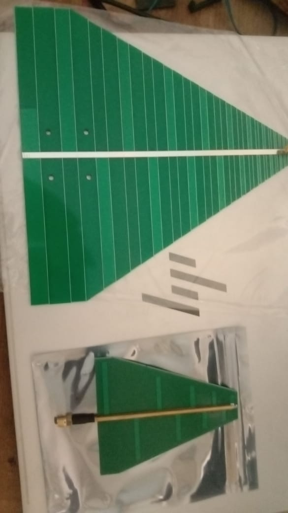
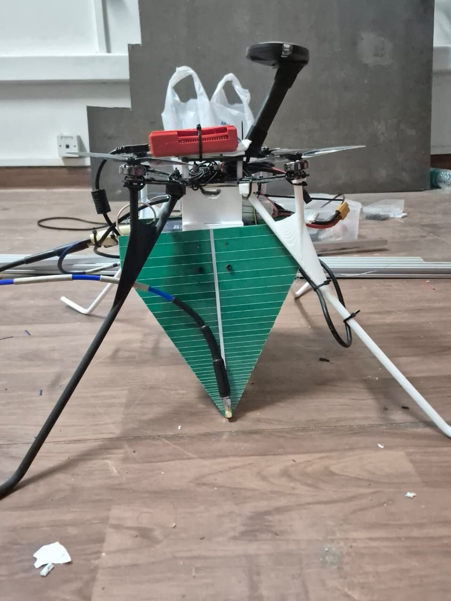
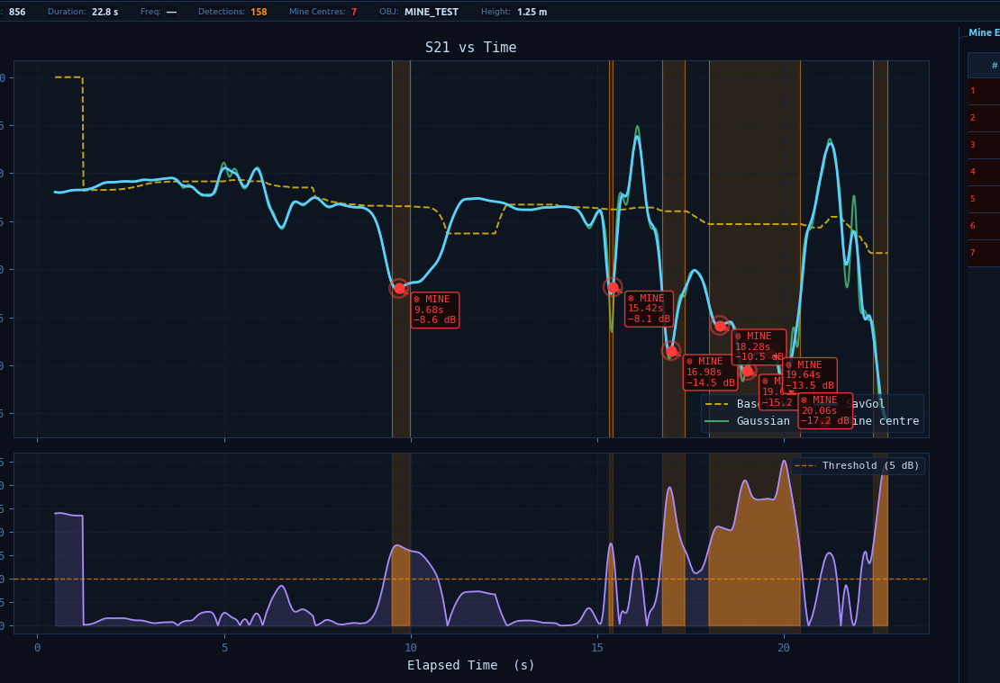
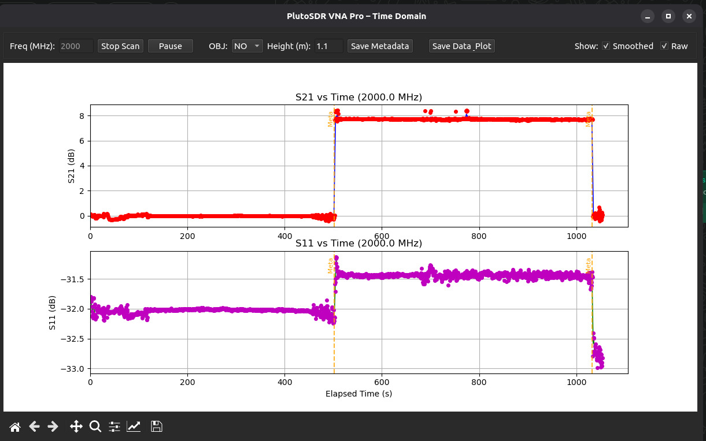
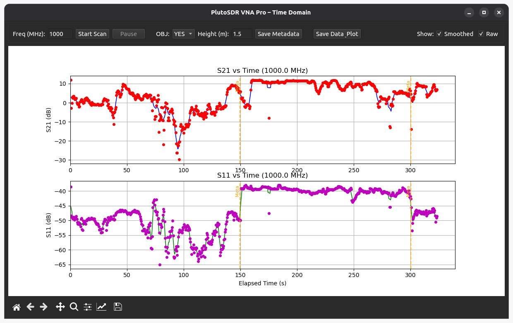
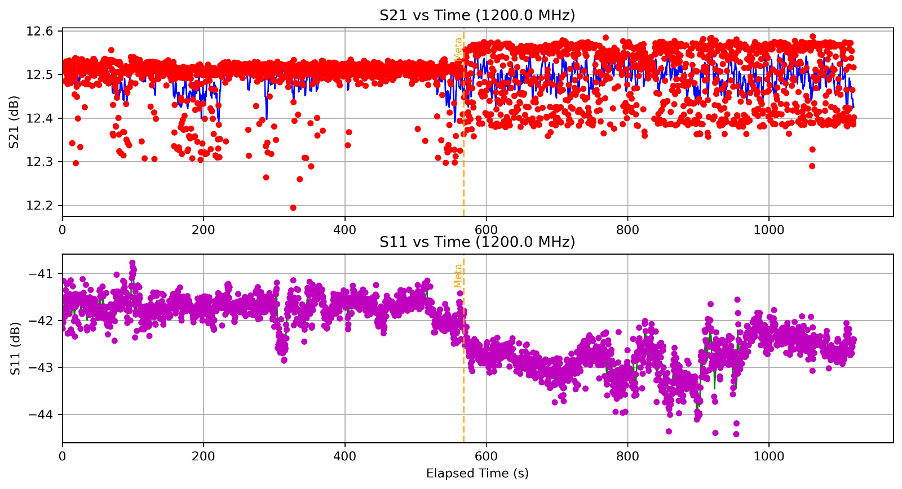
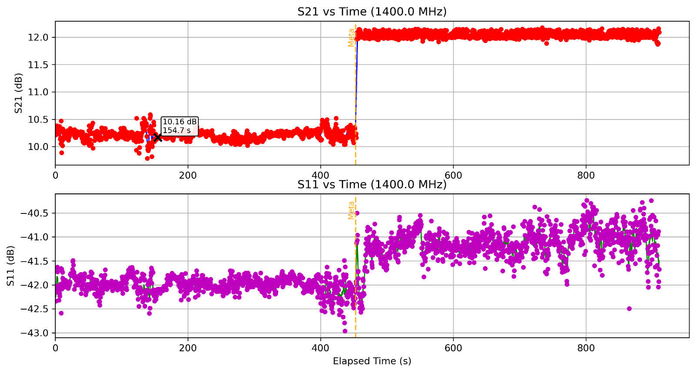
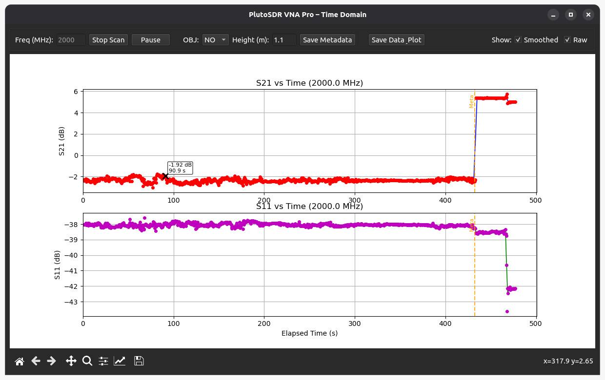
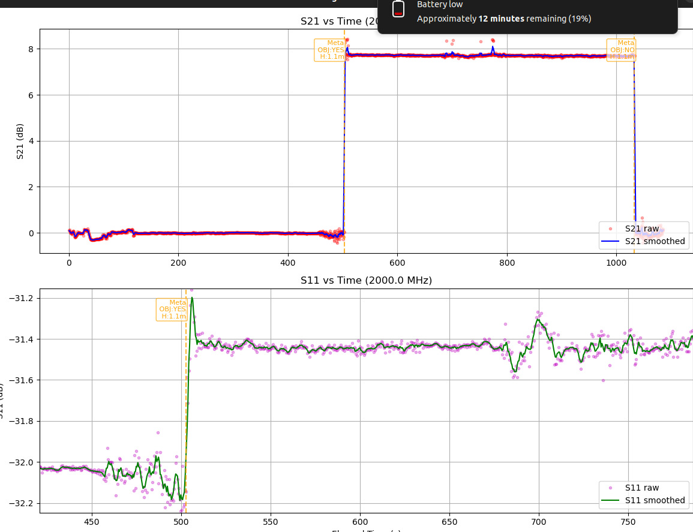

# mine-detection

**Mine-detection** is a custom ROS 2 pipeline designed for autonomous landmine detection using an Unmanned Aerial Vehicle (UAV). It utilizes a Software Defined Radio - PlutoSDR, acting as a Vector Network Analyzer (VNA) to transmit and receive radio frequencies. The system processes the received complex IQ data in real-time to detect anomalies in the soil dielectric properties and fuses these detections with the drone's odometry to accurately log the physical locations of detected mines 

<p align="center">
  
  
</p>
<p align="center">
  
  
</p>

## Table of Contents

* [Quick Start](#1-quick-start)
* [Modules and Architecture](#2-modules-and-architecture)
* [Parameters](#3-parameters)

## 1. Quick Start

This project has been developed and tested on Ubuntu 22.04 (ROS 2 Humble). However, it should be compatible with other versions of Ubuntu and ROS 2 as well.

Firstly, to install the required (system+python) dependencies:

```bash
sudo apt-get update && sudo apt-get install -y \
  libiio-dev \
  libgpiodcxx-dev \
  libomp-dev \
  libeigen3-dev

pip3 install numpy pandas scipy matplotlib PyQt6
```

Then simply clone and compile the package within your ROS 2 workspace:

```bash
cd ~/ros2_ws/src
git clone https://github.com/AerialRobotics-IITK/mine-detection.git
cd ~/ros2_ws
colcon build --packages-select mine_detector
```

After compilation, source the workspace and launch the nodes:

```bash
source install/setup.bash

# Run the VNA detector node
ros2 run mine_detector mine_detector

# Run the localization and recorder node
ros2 run mine_detector mine_recorder
```

## 2. Modules and Architecture

The core algorithms for signal processing, spatial localization, and analysis are implemented in the `src/mine_detector/src` directory:

- **`mine_detector` (`port.cpp`)**: This is a dual-threaded C++ ROS 2 node that interfaces with the PlutoSDR hardware via `libiio`. It handles real-time signal acquisition and processing. The node captures raw IQ samples, applies a precomputed lock-in amplifier algorithm utilizing OpenMP, calculates the S21 parameters, and performs signal smoothing using Gaussian and Savitzky-Golay filters. By dynamically calculating a baseline and thresholding the differential, it robustly flags the presence of targets in the soil and publishes the detection timestamps.

- **`mine_recorder` (`mine_recorder.cpp`)**: This node synchronizes the detections from the VNA module with the drone's position. It tracks the drone's trajectory by subscribing to the odometry/pose topics. When a mine detection timestamp is received, it verifies the drone's stability (to prevent false positives during sudden accelerations) by interpolating historical velocities within a specified window. Upon confirmation, it logs the mine's 3D coordinates, publishes them to `/detected_mine_pos`, which is then subsequently relayed to the navigation drone swarm.

- **`solverc.py`**: A comprehensive Python-based Qt GUI application designed for post-flight analysis. It ingests the CSV log files produced by the `mine_detector` node, providing rich interactive visualizations of the Raw S21 data, Savitzky-Golay filtering, baseline tracking, and differential signals. It automatically highlights the exact intervals where the drone detected a mine and annotates the pinpointed local minima corresponding to the mine's center.

## 3. Detection Principle (S-Parameters)

The detection pipeline relies on the analysis of Scattering parameters (S-parameters), which quantify how RF energy propagates through a multi-port network.

- **S11 (Return Loss)**: Represents the ratio of power reflected back to the transmitting antenna due to impedance mismatches.
- **S21 (Forward Transmission / Insertion Loss)**: Represents the power successfully transmitted from the Tx antenna through the medium and received by the Rx antenna.

**Target Isolation:**
In this system, the soil acts as the primary propagation medium. Under normal conditions, the S21 signal establishes a relatively stable **baseline**. The introduction of a buried landmine (metallic or non-metallic) creates a sudden dielectric contrast within the soil volume. This dielectric anomaly causes localized scattering and absorption of the RF waves, manifesting as a distinct, measurable deviation in the **S21** transmission magnitude. By continuously tracking S21 and isolating these deviations from the baseline, the system can reliably distinguish anomalous targets from homogeneous soil.

## 4. Experimental Analysis and Methodology

The frequency selection and segregation logic were empirically derived by mounting the antenna array on a mobile testing rig (a suitcase setup) and traversing varied terrain profiles with known buried targets.

<p align="center">
  
  <br>
  <em>Data collection utilizing the mobile test rig.</em>
</p>

### Frequency Band Selection

Initial evaluations conducted at lower frequency bands (1 GHz to 1.4 GHz) yielded inconsistent detection profiles. The differential (`|Diff| dB`) between the background soil and the target was minimal (approximately 2 dB), making it difficult to separate true positives from environmental noise and natural soil variations.

<p align="center">
  
  
  
  <br>
  <em>Inconsistent S21 differentials observed at 1 GHz, 1.2 GHz, and 1.4 GHz.</em>
</p>

Subsequent spectral analysis indicated that stepping up to the **2 GHz to 2.2 GHz** band provided optimal contrast for the specific soil-target dielectric mismatch. At these frequencies, the presence of a mine induced a sharp, unambiguous **6 dB to 8 dB differential** in the S21 signal magnitude.

<p align="center">
  
  
  <br>
  <em>Pronounced 6 dB to 8 dB differentials isolated within the 2 GHz band.</em>
</p>

### Signal Segregation Logic

Based on the 2 GHz band data, the real-time detection strategy was formalized as follows:
1. **Signal Conditioning**: Raw S21 samples are smoothed using cascaded Gaussian and Savitzky-Golay filters to attenuate high-frequency noise.
2. **Dynamic Baselining**: A rolling median estimator tracks the slow-varying soil baseline.
3. **Threshold Detection**: The absolute difference `|Diff|` between the conditioned S21 signal and the baseline is computed. If `|Diff|` exceeds the configured `detect_thresh` (e.g., 8.0 dB), a target is flagged. The local minima within this thresholded region precisely corresponds to the physical center of the target.
